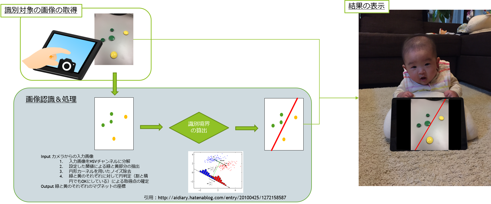

# simple_classification_demo
これは基礎的なパターン認識アルゴリズムを用いた「おもちゃ」です。

## Overview

## Install
- python anaconda
- opencv3
- wxPython Phoenix
- cvxopt
  
  
参考サイト(for Windows)
- [Windows Anacondaインストール](https://qiita.com/t2y/items/2a3eb58103e85d8064b6)
- [opencvインストール参考サイト](http://imagingsolution.net/program/python/anaconda/install_opencv_anaconda/)
- [wxPython Phoenixインストール参考サイト](https://ameblo.jp/maplerain78/entry-12265793422.html)
- [cvxopt インストール参考サイト](https://stackoverflow.com/questions/40580530/how-to-install-cvxopt-on-windows-7-64-bit-machine-for-python-3-5-of-anaconda)

## author
[taiga4112](https://github.com/taiga4112)